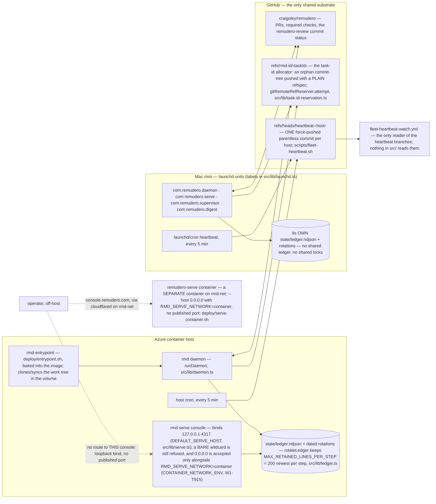
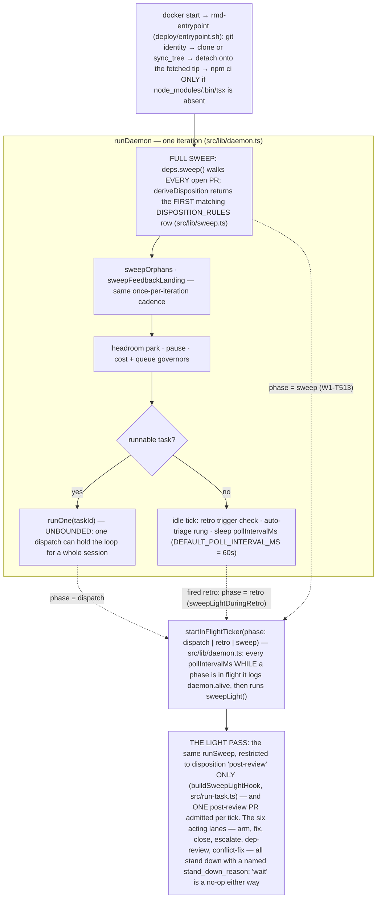
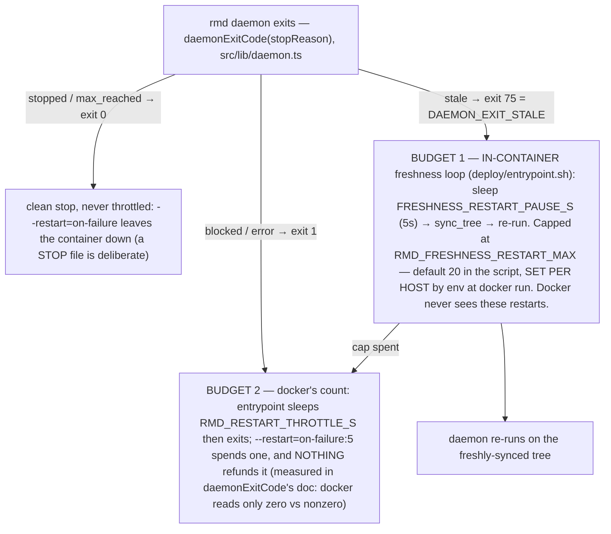

# System diagrams

Three Mermaid diagrams of how remudero actually runs: the two hosts, the daemon loop, and the
idea-to-deployed pipeline. Every edge below is derived from a named symbol read at commit
`2cfebb8` (origin/main, 2026-08-18), cited as `symbol` (`file`) — never a line number, because
line numbers drift. Figures marked *(ledger, 2026-08-18, on-host)* were measured from a host's
ledger union on that date: they are dated observations, not invariants — re-derive with
`rmd ledger-grep` on the host before quoting one. Everything unmarked is re-derivable from the
tree at that commit.

**Why this file, and why here.** `docs/ORIENTATION.md` is a generated artifact
(`regenerateOrientation`, `src/lib/orientation.ts`) — a retro pass overwrites it.
`docs/operator-guide.md` is parsed by two gates (`checkVerbCoverage` in
`test/docs-claims.test.ts`; `REQUIRED_PROCEDURES` via `src/lib/runbook-coverage.ts`).
`MASTER-PLAN.md` carries a machine-owned CAPABILITY SNAPSHOT block, and
`plan/plan-index.json` tracks its headings. `docs/architecture.md` is the hand-written
conceptual map from before the two-host split and the `plan/tasks.d/` shards. A fresh file
under `docs/` is the one place no generator rewrites and no gate parses: the review gates
classify it docs-only — `isDocsPath` true; `isInPlanScope` false (that predicate is exactly
`MASTER-PLAN.md || docs/ORIENTATION.md || plan/**`, `src/lib/plan-architect.ts`); no
`INSTRUMENT_SURFACE` pattern (`src/lib/review.ts`) matches it — verified by running those
predicates in-process against four control paths.

Diagrams render natively on GitHub and diff as text, which is how this repo reviews.

---

## 1. Two hosts, one repository

Disjoint by design. W1-T433's falsifier
(`plan/tasks.d/W1-T433-wild-trails-cell-pilot.yaml`) requires it in both directions: *"the two
consoles report DISJOINT state (a task dispatched in one never appears in the other's ledger,
status or inflight) … a shared anything fails one of the two."* The only bridges are GitHub
itself and one heartbeat branch per host — and the heartbeat branches are read by a workflow
(`.github/workflows/fleet-heartbeat-watch.yml`), not by anything in `src/`
(`deriveLastPoll` in `src/lib/daemon-health.ts` reads the local ledger, never a branch).

**The DAEMON's own console is still a dead end; the fleet's console no longer is.** `rmd serve`
binds `127.0.0.1:4317` by default (`DEFAULT_SERVE_HOST` in `src/lib/serve.ts`) and a BARE wildcard
is still refused — `assertBindableHost` throws for `::`, `*` and `""` unconditionally, and for
`0.0.0.0` too unless the caller ALSO declares `RMD_SERVE_NETWORK=container`
(`CONTAINER_NETWORK_ENV`, W1-T915). That pairing is the one carve-out, and it is deliberately two
independent things typed together so a fat-fingered `--host 0.0.0.0` on a bare host still fails as
loudly as before. Since 2026-08-22 a separate `remudero-serve` container takes it: on `rmd-net`,
`--host 0.0.0.0` with that env var set, no published port, reached at `console.remudero.com`
because cloudflared resolves `http://remudero-serve:4317` BY NAME over Docker's embedded DNS
(`deploy/serve-container.sh`, recorded in #2534). **So "console-only escalations are unreachable
from off-host" is no longer true** — W1-T915
(`plan/tasks.d/W1-T915-the-escalation-surface-has-no-address.yaml`) filed that gap and this is what
closed it. The daemon container itself still publishes nothing, which is why the edge above is
drawn to the serve container and not to it.

**Per-host notes, dated.** Each beat carries three shas so mount-vs-image drift is visible
off-host: `daemon_boot_head_sha` and `install_head_sha` read the mounted checkout,
`image_build_sha` reads `/etc/rmd-build-sha` baked by `deploy/Dockerfile` (W1-T496). The image
itself is rebuilt ONLY by `.github/workflows/acr-build.yml`, which is `workflow_dispatch` —
an operator action, never automatic on merge. `com.remudero.daemon` on the mini is booted out
by the operator as of 2026-08-18 (runtime state, not derivable from the tree).

---

## 2. The daemon loop

The shape that gets misread most. Two separate restart budgets, one narrow in-flight ticker,
and a first-match-wins disposition table whose evaluation order is NOT the order its type
union reads.

The exact restriction is `actionable: (d) => d === "post-review"` in `buildSweepLightHook`
(`src/run-task.ts`); the stand-down happens at the `deps.actionable` check inside `runSweep`
(`src/lib/sweep.ts`), and a second in-pass guard serializes post-review itself to one PR per
tick. *(ledger, 2026-08-18, on-host: 94.7% of `blocked-fixable` dispositions were deferred by
this asymmetry — the light pass sees them and stands down until the loop next idles.)*

**The full sweep is the idle-poll rung, and it stalls while a phase is in flight.** It runs at
the top of every iteration and nowhere else (`deps.sweep` "only runs BETWEEN iterations" —
`startInFlightTicker`'s own doc), so a long `runOne` or retro delays the next full sweep by its
whole duration. *(ledger, 2026-08-18, on-host: gap between full sweeps median 2.6 min, p90
17 min, max 274.9 min.)* The in-tree companion figure, measured in the `startInFlightTicker`
doc comment over 898 `daemon.iteration` rows: dispatch-to-next-daemon-row window p50 2.4 m,
p90 39.5 m, p95 52.5 m.

### The two restart budgets — conflating them costs outages

`75` is `EX_TEMPFAIL`, duplicated into the entrypoint on purpose and pinned by
`test/entrypoint-boot.test.ts`. The value of `RMD_FRESHNESS_RESTART_MAX` in production is
environment-supplied, not in the tree — the script's default is 20.

### DISPOSITION_RULES — evaluation order, which is not the type-union order

`type Disposition` (`src/lib/sweep.ts`) reads
`mergeable | blocked-fixable | stale | blocked-ambiguous | dep-review | post-review |
conflicted | wait` — but that is the TYPE, not the precedence. `deriveDisposition` returns the
first matching row of the `DISPOSITION_RULES` array, whose actual order at `2cfebb8` is:

1. `stale` — superseded verdict (gated by `policy.supersessionDisposalEnabled`, default off)
2. `stale` — `supersededBy` set (unless the concept-coexistence gate clears it)
3. `stale` — no activity ≥ `policy.staleDays` (14, `plan/policy.yaml`)
4. `dep-review` — Dependabot PRs, routed before any failure row
5. `blocked-fixable` — an operator answer re-arms the fix rung within its strike allowance
6. `blocked-ambiguous` — strikes exhausted (review-failure or checks-red, one shared ladder)
7. `blocked-fixable` — checks red (`isBlockedCi`), strikes left → the ci-log fix mode
8. `blocked-fixable` — review failing with actionable unmet criteria or a named gate remedy
9. `blocked-ambiguous` — review failing with nothing actionable (contradictory / unrecoverable)
10. `conflicted` — dirty merge state AND `isPureConcurrentAddition` (deterministic fix)
11. `blocked-ambiguous` — dirty with a deletion involved: never auto-resolved
12. `mergeable` — POSITIVE match only: checks green AND review success
13. `blocked-ambiguous` — zero-run required check whose one deterministic re-post was refused
14. `blocked-ambiguous` — review orphaned by pushes past `policy.reviewOrphanCap` (2)
15. `post-review` — checks green, review never posted / orphaned / stuck-pending past ceiling
16. `wait` — a FRESH `remudero-review` pending (a review is genuinely in flight)
17. `wait` — checks pending with a datable age under `policy.pendingCeilingMinutes` (60)
18. `blocked-ambiguous` — stale-pending: datable checks-pending at or past that ceiling
19. `blocked-ambiguous` — the terminal catch-all: escalate, never arm by default

### The fix rung — two strikes, four ledger steps

A `blocked-fixable` disposition dispatches the fix rung (`src/run-task.ts`), which ledgers
`fix.dispatch` on entry and settles as exactly one of `fix.resolved`, `fix.exhausted`
(strikes ≥ `sweep.strikeCap` = **2**, `plan/policy.yaml`, lifted from
`DEFAULT_SWEEP_POLICY.strikeCap`), or `fix.stood_down` (foreign-branch authorship, rule-15 /
instrument entanglement, false-block and kindred guards — each with a named `site`).
Exhaustion routes to the same `blocked-ambiguous` escalation every other ambiguous block uses.

---

## 3. Idea → deployed

The full loop, with the operator gates marked **[operator gate]** and the places it stops
drawn rather than implied.

```mermaid
flowchart TD
    FB["plan/feedback/‹id›.yaml at status: new — captured by rmd feedback or console POST /v1/feedback; landFeedback (src/lib/feedback-landing.ts) rebuilds from origin/main's tip and pushes, so a container's capture survives the container"]
    TRI["auto-triage rung, in runDaemon's idle branch — fires on deferredPairings = partition.serialized.length ≥ 1 (src/lib/daemon.ts), bounded by autoTriage.minIntervalMinutes / maxPerDay (plan/policy.yaml)"]
    MINT["id minted at refs/rmd-id/‹id› — orphan commit-tree over the empty tree, PLAIN refspec push (no plus, no lease); reserveTaskIdRemote → gitRemoteRefReserver.attempt. A non-fast-forward rejection IS the gate: the loser renumbers, the ref is never deleted"]
    SHARD["shard filed: plan/tasks.d/‹id›-‹slug›.yaml — lands through its own PR, same checks as any other. [operator gate] Note: the shard's stored status: field is decorative; merge-state is DERIVED from GitHub (lib/status.ts)"]
    ELIG["isDispatchEligible (src/lib/drain.ts): verify: human is filtered BEFORE the linter (t.verify !== 'auto' → 'verify-not-auto') · status blocked · unmet deps · an already-open PR (isOpenPr) · file-overlap serialization (overlappingPaths, src/lib/dispatch-overlap.ts) · preDispatchLint (only proof-dialect blocks here)"]
    WT["worktreeAdd(…, 'origin/main') — a fresh worktree per run, branch run-‹taskId›-‹epochMs› (the shape projectPlan and findMergedByHeadBranch credit)"]
    REC["recon worker — its own mount row: task_type 'recon' × risk × class (resolveMountForClass, src/run-task.ts)"]
    IMP["implement worker — commits on the run branch, pushes"]
    PR["PR opened — armAutoMergeAtOpen roughly 16s later, with NO verdict gate at open; the triage lane's arm is verdict- and CI-gated instead (both call attemptArm, src/run-task.ts — the lane asymmetry operator ruling W1-T489 documents rather than changes)"]
    CHK["the 14 REQUIRED check runs + ci-gate, the always-reporting aggregator (REQUIRED list and WAIT_CAP_SECONDS 2400 in .github/workflows/ci-gate.yml)"]
    REV["remudero-review — a COMMIT STATUS, not a check-run (postReviewStatus, src/lib/review.ts), posted by the sweep's post-review lane at checks green + review none; /check-runs alone cannot see it"]
    MERGE{"MERGE [operator gate] — armed auto-merge fires once green + PASS; every unarmed or capped PR waits for a human"}
    DEP["mini: com.remudero.supervisor runs rmd deploy-run on a 2-minute tick (SUPERVISOR_LABEL, src/lib/launchd.ts) — decideDeployTrigger (src/lib/deployer.ts) deploys when the install is behind origin/main OR runningStale, then kickstarts the daemon unit"]
    RESTART["the daemon comes back on the new sha — Azure: the exit-75 freshness loop re-syncs in-container; the IMAGE half of a diff (deploy/entrypoint.sh, Dockerfile, apt binaries) ships ONLY via acr-build.yml, workflow_dispatch [operator gate]"]
    FB --> TRI --> MINT --> SHARD --> ELIG --> WT --> REC --> IMP --> PR --> CHK --> REV --> MERGE --> DEP --> RESTART
```

### Where it stops — measured, because that is what makes the picture useful

- **`verify: human` never dispatches.** `isDispatchEligible` returns false at
  `t.verify !== "auto"` before the linter is even consulted, so a human-verify shard sits in
  the plan until an operator acts. It cannot stall the queue; it also cannot move itself.
- **The feedback inlet outpaces triage and nothing ages it.** At `2cfebb8`,
  `plan/feedback/` holds 149 entries: **62 `status: new`**, 49 rejected, 25 accepted,
  13 proposed. No code path deletes or archives an entry; a status advances only when a
  triage PR merges an edit to the file.
- **The deploy rung no-ops silently at exit 0 when its preconditions fail.**
  `deployRunCommand` (`src/run-task.ts`) prints `no-op: ‹reason›` and returns 0 when
  `assessInstallForDeploy` refuses (absent, dirty, off-main, diverged install root) —
  provisioning is exclusively `rmd install-checkout`'s job. *(ledger, 2026-08-18, on-host:
  the mini's deploy-run refused 744 times at exit 0 while its install root was never
  provisioned; W1-T924 fixed the root resolution.)*
- **Merges are the narrowest bridge.** Every artifact of the loop — feedback landing, shard,
  implementation, review verdict, deploy — crosses between hosts only by landing on
  `origin/main`. Anything that does not merge does not exist to the other host.

---

*The documentation-staleness findings from the same recon (stale claims in `CLAUDE.md`,
`src/lib/service.ts`, `docs/architecture.md`, `docs/task-lifecycle.md`, `openapi/daemon.yaml`
coverage, and the decorative shard statuses) are reported to the operator separately and
deliberately not edited in this change.*
